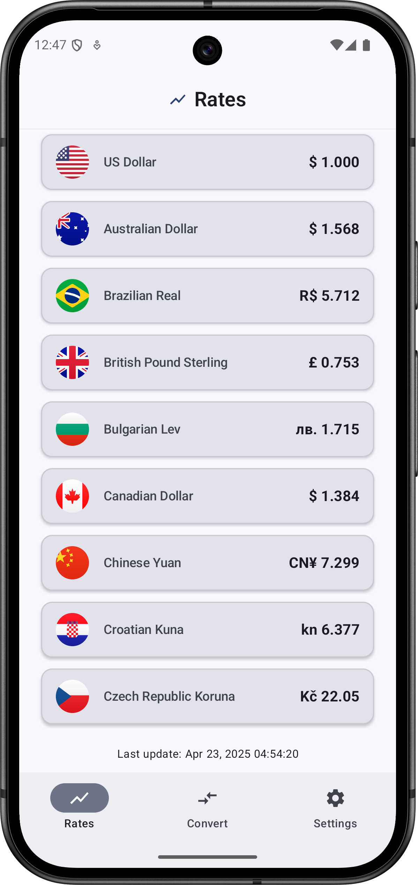
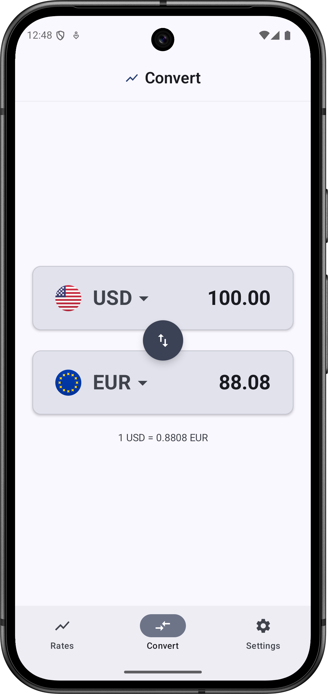

# 💱 Currency Converter – Android App

A modern, modular, and production-style **Currency Converter app** built with Kotlin, Jetpack
Compose, and a clean multi-module architecture.

## 📸 Screenshots

  
  

## ✨ Features

- 🌐 Real-time exchange rate conversion using a public currency API
- 🔁 One-tap currency swapping with remembered preferences
- 🔄 Pull-to-refresh and automatic staleness checking
- 🧭 Bottom navigation with screens for Rates, Converter, and Settings
- 📱 Jetpack Compose UI with dynamic layout and theming
- 🎌 Region flags and locale-aware currency formatting
- 💾 Offline-first sync strategy with caching and timestamp tracking
- 🧪 ViewModel-driven state with clean separation between domain and UI
- 📦 Modular architecture with feature-based separation (`app`, `rates`, `converter`, etc.)

## 🧰 Tech Stack

- **Kotlin**, **Jetpack Compose**, **Coroutines**, **Flow**
- **Koin** for dependency injection
- **MVVM** architecture + unidirectional data flow
- **Room** (optional caching) or in-memory persistence
- **Multi-module setup** for scalable code organization

## 🚀 Status

The app is **MVP complete and live** on Google Play: 

  

Recent improvements:

- ✅ Tap-to-convert from currency rate list
- ✅ Custom `CurrencyAmountField` for better input control
- ✅ Swap button for source/target currencies in converter
- ✅ Persisted conversion state using DataStore
- ✅ Polished layout and modernized UI
- ✅ Published Play Store release with final styling and visuals

Coming later:

- 🛑 Error handling with custom result class and UI surfacing
- ⚙️ Onboarding flow (select default currency)
- 🧪 Unit tests for error handling and sync policy
- 📈 Charts for historical rate data
- 🔧 CI setup with GitHub Actions

## 🔐 API Key Handling

This app is a portfolio MVP. API usage is limited to non-sensitive endpoints, and keys are scoped
appropriately.  
In a production-grade app, a secure backend proxy or runtime key protection would be implemented.

## 📃 License

This project is licensed under the terms of the [MIT License](./LICENSE).  
Includes country flag assets from [FlagKit](https://github.com/madebybowtie/FlagKit) by Bowtie (MIT
License).
